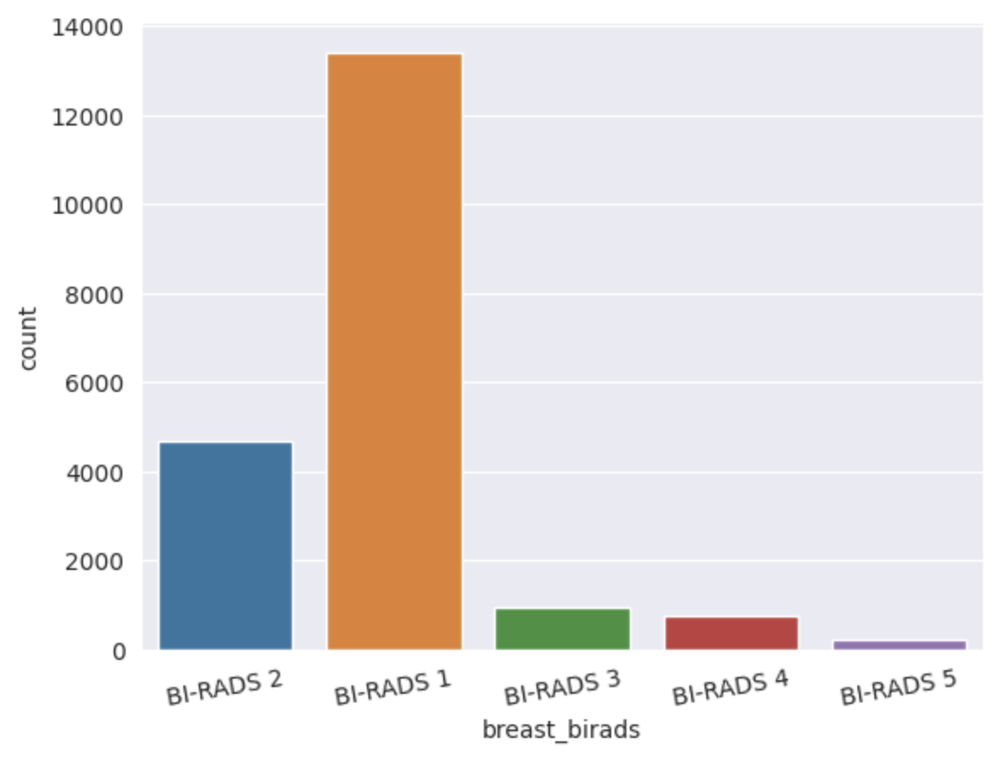
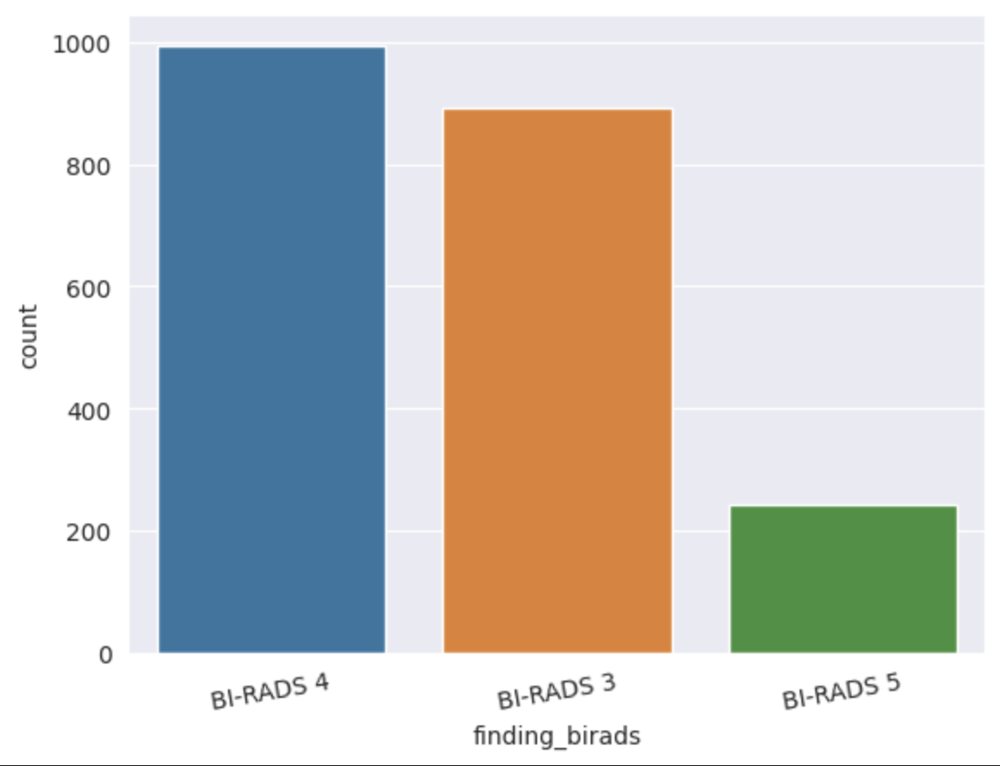

# VinDR-Mammo | Breast Mass Detection

**Paper:** [VinDR-Mammo Paper](https://www.nature.com/articles/s41597-023-02100-7)

**Repository:** [VinDR-Mammo GitHub Repository](https://github.com/vinbigdata-medical/vindr-mammo/tree/master)

## Repository Purpose

The aim of this repository is to create a basic ML pipeline to detect breast cancer areas using the VinDr-Mammo dataset.

## Data Processing and Training 

Currently, there are trained two model variants, YOLOv5-S and YOLOv5-L. Each model is trained for 10 epochs. Dataset is processed to include just mass categories. Because there is a high category imbalance and the most frequent category is mass type for cancer. Two types of detection are used: BI-RADS and Mass. BI-RADS detection consists of 3-class: BI-RADS 3, BI-RADS 4, and BI-RADS 5. Each mass is detected and classified accordingly. However, it suffers from data-imbalance, as BI-RADS 3 is more frequent. Mass detection consists of 1-class: Mass. The goal is to detect only mass areas, which achieves great performance.

  
  

### Abstract of Dataset Paper

Mammography, or breast X-ray imaging, is the most widely used imaging modality to detect cancer and other breast diseases. Recent studies have shown that deep learning-based computer-assisted detection and diagnosis (CADe/x) tools have been developed to support physicians and improve the accuracy of interpreting mammography. A number of large-scale mammography datasets from different populations with various associated annotations and clinical data have been introduced to study the potential of learning-based methods in the field of breast radiology.

With the aim to develop more robust and more interpretable support systems in breast imaging, we introduce VinDr-Mammo, a Vietnamese dataset of digital mammography with breast-level assessment and extensive lesion-level annotations, enhancing the diversity of the publicly available mammography data. The dataset consists of 5,000 mammography exams, each of which has four standard views and is double read with disagreement (if any) being resolved by arbitration.

The purpose of this dataset is to assess Breast Imaging Reporting and Data System (BI-RADS) and breast density at the individual breast level. In addition, the dataset also provides the category, location, and BI-RADS assessment of non-benign findings. We make VinDr-Mammo publicly available as a new imaging resource to promote advances in developing CADe/x tools for mammography interpretation.